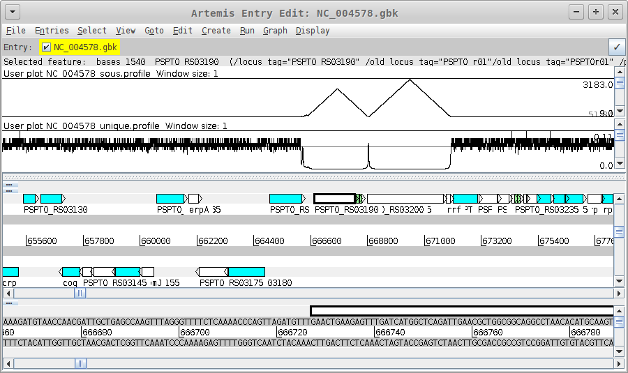

# sous

This is a script for calculating Shortest Overlapping Unique
Sequences (SOUS) profiles for bacterial genomes. The SOUS can be used
as a measure of the mapability or uniqueness of genomic regions. That
is, the *longer* the SOUS at a position, the *less* unique the
sequence at that base. The uniqueness of the sequence at a base can be
quanified as the inverse of the SOUS (1/SOUS).

# Installation

The `sous` script is written in Perl and relies on a handful of
external libraries that should be part of the Perl core.

Just put the script somewhere on your `$PATH`.

# Usage

    $ ./sous -h
    Usage: sous [options] *.fna
    -D INCR - increment of k (even) [2]
    -L LB - minimum k (odd) [1]
    -U LB - maximum k [\inf]
    -d DIR - output directory [.]
    -h - print help
    -t TAG - tag for output sous files (required, unless -u)
    -u TAG - tag for output uniqueness files (required, unless -t)
    -q - be quiet
    $ 

# Example

Here is how to compile SOUS and uniqueness profiles for
the chromosome of _P. syringae_ DC3000.

    ./sous -q -t sous -u unique .../NC_004578.fna

Below is a screnshot that shows that the profiles look like when
viewed in
[Artmeis](http://www.sanger.ac.uk/science/tools/artemis). The region
illustrated contains some rRNA genes, and shows that in the regions of
the repetitive genes (DC3000 has 5 copies), the SOUS gets longer and
the uniqueness drops to near zero.

# Performance

Not great. SOUS uses a brute-force *k*-mer scheme to build a data
structure for computing sequence extensions. It's written Perl and has
not been parallelized. The example above ran in about 12 minutes on
a laptop with 16GB of memory. It is reasonable for use with bacterial
genomes; I would not recommend it for anything larger.

